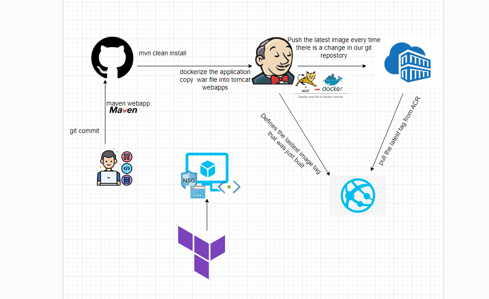
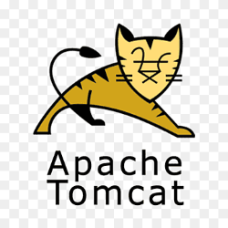
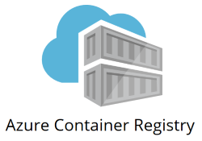
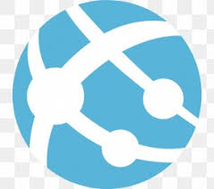

# Welcome to my Maven-Tomcat Project ! 🐱
**introduction** :
In this project we created a simple application using maven.
First, with the help of terraform, we will set up a machine in Azure which will be used by us for the entire CI CD process.
After that we will use jenkins for CI to build the maven application, and create a .war file for us.
After that, he will package the application using docker that will be built according to the dockerfile based on tomcat:9, and push it to ACR in Azure.
After that we will reach the CD part, this process will also run with jenkins.
We will change the image tag for our webbapp that runs in Azure, and thus we can assign the tags according to the latest image in ACR




---


## stpes : 🔨

## Web Application with Maven :
Our application is a simple code for a web app that will use a .war file that will eventually run with tomcat.



---

### Terraform - set up a virtual machine in Azure ⛅ :

At this stage we will first set up a virtual machine in azure, of course we will also need vnet, subnet, nsg, public ip and more..
Inside the main.tf file we define all these components, including opening port 22 and 8080 in order to allow jenkins to run, and for us to connect to the machine.
The machine will receive a password according to terraform.tfvars which is in .gitignore and contains sensitive information.
Finally, you we do the following commands:

**terraform init**

**terraform plan -out=tfplan**

**terraform apply tfplan**


---


## Setup the Virual machine :
After our machine is in the air, we will connect to it with SSH, and with the password we set in terraform.tfvars.
We will have to install various tools on the machine, such as docker, maven and azure cli.
Because this machine will be used as an agent for Jenkins.

**install Docker**
```bash
  sudo apt-get update
  sudo apt install docker.io
  sudo usermod -aG docker $USER
  sudo usermode -aG docker jenkins
```

**install azure cli**
```bash
  Refer --- https://learn.microsoft.com/en-us/cli/azure/install-azure-cli-linux?pivots=apt
  curl -sL https://aka.ms/InstallAzureCLIDeb | sudo bash
```

**install maven**
```bash
  wget https://mirrors.estointernet.in/apache/maven/maven-3/3.6.3/binaries/apache-maven-3.6.3-bin.tar.gz
  tar -xvf apache-maven-3.6.3-bin.tar.gz
  mv apache-maven-3.6.3 /opt/

  M2_HOME='/opt/apache-maven-3.6.3'
  PATH="$M2_HOME/bin:$PATH"
  export PATH
```

---
## Create ACR & Webapp Service :


**ACR**
Inside the auzre portal, an ACR will be opened that will contain the images built for our application.




**Webapp Service**
We will open webapp serivce, a Linux type that runs containers and later will run our application.




---

## Jenkins
**create credentials to connect to ACR from Jenkins** :
Inside the azure portal, enter the ACR we created, then the 'Access key'.
We will create a new credential in Jenkins called 'ACR', and use the username and password according to the access key.


**Create service principal** :
In the azure portal, we need to create a service principal with Contributor permissions that will be used by Jenkins to update the tag.
After that enter it as a credential in Jenkins.

**Create CI pipeline (jenkinsfile)** :
We will create a pipeline with a link to our git folder, which will check if there is a change in the code every 5 minutes.
if there is a change it will run the pipeline which will build the docker image and push it into the ACR we created in Azure.
If the pipeline is successful, a trigger will be made for the pipeline of the CD.


**Create CD pipeline (jenkinsfileCD)** :
This pipeline will be automatically activated according to the CI pipeline.
After the new docker image is built with tag latest, this pipeline will configure azure webapp to pull the new image.


